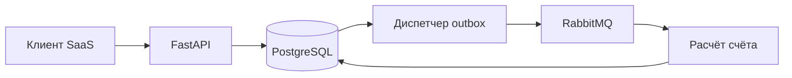

# Как устроен расчёт

API принимает события и запросы на выпуск счёта. PostgreSQL хранит журнал и результат расчёта. Диспетчер отправляет `job_id` из outbox в RabbitMQ, worker выпускает счёт и подтверждает сообщение после commit.

## Журнал и граница расчёта

У каждого клиента собственный монотонный `sequence`. Приём события блокирует строку клиента, проверяет повтор по `external_id`, увеличивает счётчик и вставляет событие одной транзакцией. Это намеренно не глобальный PostgreSQL sequence: номер, выданный обычной последовательностью, не гарантирует порядок commit.

Worker берёт ту же блокировку и фиксирует `cutoff` — номер последнего принятого события. Дальше он читает события нужного UTC-месяца до этой границы, выпускает счёт и завершает задачу в одной транзакции. Параллельные запросы клиента ждут окончания расчёта. Другие клиенты имеют свои блокировки.

Граница выбирается в момент обработки worker, а не HTTP-запроса на выпуск. Событие, принятое между этими моментами, может попасть в счёт. После выпуска набор источников зафиксирован навсегда.

Поток чтения идёт пакетами по 1000 строк. В памяти остаются хеш источников и суммы по версиям тарифов. Стоимость расчёта линейна по числу событий месяца. Для одного клиента приём событий сериализован; это осознанное ограничение первой версии. Продолжительный расчёт задерживает его новые записи. Шардирование клиента и отдельный протокол фиксации границы здесь не реализованы.

## Тарифы и арифметика

Три метрики: `api_calls`, `storage_gb_hours`, `compute_seconds`. API-вызовы считаются целыми числами, остальные величины допускают дробную часть. Клиент передаёт готовую измеренную величину; сервис не снимает показания хранилища или CPU сам. Валюта первой версии — USD, все счета демонстрационные.

Количество приходит десятичной строкой с точностью до шести знаков, цена — до восьми. JSON-числа для этих полей запрещены: преобразование через двоичный float может потерять исходную точность. PostgreSQL хранит `numeric`, расчёт выполняется в Python `Decimal` с точностью 50 значащих цифр. [PostgreSQL numeric](https://www.postgresql.org/docs/current/datatype-numeric.html), [Python Decimal](https://docs.python.org/3/library/decimal.html).

Тариф действует с `effective_at` включительно до начала следующей версии той же метрики. При поступлении события выбирается версия по `occurred_at`; её ID и цена сохраняются в журнале. Администратор может добавить тариф только минимум за минуту до начала действия и максимум на год вперёд. API не разрешает вставить тариф задним числом. Начальные тарифы с 2020 года создаёт seed.

Сумма считается отдельно для каждой пары «метрика + версия тарифа» за месяц:

`cumulative_cents = ROUND_HALF_UP(sum(quantity) × unit_price × 100)`

Плата за каждое отдельное событие не округляется. Изменение тарифа в середине месяца образует две группы, каждая округляется отдельно. Абонентская плата, бесплатные лимиты, ступенчатые тарифы, налоги, конвертация валют и интеграция с платёжными провайдерами не входят в эту версию.

## Поздние события и исправления

События могут приходить за любой прошедший период с 2020 года. После закрытия календарного месяца позднее событие не меняет уже выпущенный счёт. Новый запрос на выпуск создаёт следующую ревизию с разницей между новым накопленным начислением и предыдущим.

Пример при цене $0.00001 за запрос: 500 запросов дают 1 цент после округления. Ещё 100 поздних запросов оставляют общую сумму 1 цент — корректировка равна нулю, но новая ревизия сохраняет новый набор источников. Отмена исходных 500 запросов оставляет 100 запросов и 0 центов: следующая корректировка равна −1 центу.

Исправление расхода — отрицательная запись со ссылкой на положительное исходное событие. Она наследует его время, метрику и цену. Сумма исправлений не может превысить исходное количество, включая параллельные запросы. Исправление другого исправления запрещено. Если нужно увеличить расход или перенести его в другой период, сначала исправляют исходное событие, затем добавляют новое положительное событие.

Счёт с тем же набором источников повторно не выпускается. При оплате нельзя суммировать `cumulative_cents` всех ревизий: сумма обязательств за период — сумма `delta_cents`, равная последнему `cumulative_cents`.

## Воспроизводимость

В счёте есть версия алгоритма `flat-monthly-v1`, период, граница журнала, предыдущий счёт, количество и SHA-256 исходных строк, объяснение каждой группы и хеш расчёта. `/verify` заново читает журнал до той же границы и сравнивает полный результат. `/events` у счёта показывает исходные события с пагинацией.

При изменении алгоритма нельзя переписать функцию v1 и продолжить выдавать тот же номер версии. Нужно оставить прежний код расчёта доступным и добавить отдельную версию. Сейчас существует один алгоритм, обработчик неизвестной версии явно отказывает.

## Сбои и границы гарантий

Запрос на выпуск и outbox записываются одной транзакцией. Недоступный RabbitMQ не мешает принять расход или задачу. Диспетчер использует publisher confirms. Падение между confirm и отметкой в БД допускает дубль. Worker проверяет состояние задачи и выпускает счёт под блокировкой клиента; повторная доставка завершённой задачи не создаёт новый документ. [Гарантии RabbitMQ](https://www.rabbitmq.com/docs/confirms).

Подтверждённые сообщения незавершённых задач публикуются повторно каждые пять секунд. Ошибка расчёта увеличивает счётчик; после пяти зарегистрированных ошибок задача становится `failed`, администратор может повторить её после устранения причины. SIGKILL до commit откатывает всю транзакцию и приводит к повторной доставке. Такие аварии не расходуют счётчик зарегистрированных ошибок. Постоянный аварийный выход требует вмешательства оператора.

Некорректное тело сообщения переносится в `meterledger.quarantine`. Heartbeat показывает, что процесс работает и достигает БД; доступность RabbitMQ проверяется отдельно. Развёртывание состоит из одного PostgreSQL и одного RabbitMQ, высокой доступности кластера здесь нет.

## Доступ

Администратор создаёт клиентов и получает случайный API-ключ один раз. В БД хранится только SHA-256 ключа. Все клиентские запросы получают tenant ID из ключа, а не из тела запроса. Проверка владельца есть для событий, исходного события исправления, задач, счетов, источников и курсора пагинации.

Миграции выполняет `billing_owner`, runtime — роль `billing`. У runtime нет UPDATE/DELETE/TRUNCATE на журнале, тарифах и счетах. Триггеры дополнительно запрещают UPDATE/DELETE даже владельцу таблиц. Это защита от обычных ошибок приложения, не WORM-хранилище: администратор PostgreSQL может отключить триггеры или изменить схему. Доступ к БД доверенный; RLS, управление сотрудниками и ротация клиентских ключей не реализованы.

Порт API опубликован только на `127.0.0.1:8210`. PostgreSQL и RabbitMQ не имеют host-портов. Для внешнего развёртывания нужны свои секреты, TLS-прокси, лимиты запросов и резервное копирование. Демо-ключи предназначены для локального стенда.
